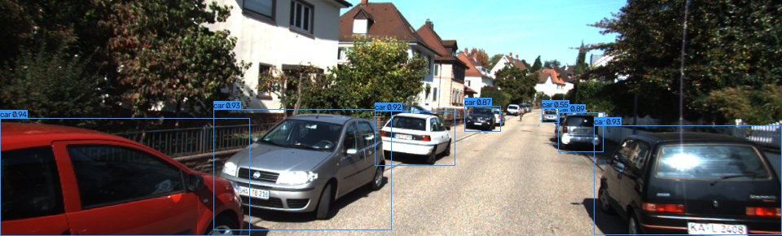

# drive-perception

Real-time driving-scene object detection and tracking, taken the whole way from raw
KITTI frames to a fine-tuned model, an honest benchmark across inference backends, and a
containerised service you can call over HTTP.

**[Live demo](https://drive-perception.streamlit.app)** · [Results](reports/results.md) ·
[Design notes](docs/design.md)



A YOLO11 detector is fine-tuned on KITTI to find cars, pedestrians and cyclists, feeds a
tracker that holds object identities across frames, and is exported to ONNX and measured
on CPU, Apple CoreML and NVIDIA TensorRT. The same ONNX model runs behind a FastAPI
service and a Streamlit demo, neither of which needs PyTorch installed.

## Highlights

- Fine-tuning lifted detection from **0.394 mAP50 zero-shot to 0.858** (yolo11n) and
  **0.883** (yolo11s) on the full KITTI validation set.
- The exported model matches PyTorch to **sub-pixel box differences**, so the speed
  numbers compare the same detections rather than two different models.
- CoreML runs the edge model at **127 FPS** on an Apple laptop; TensorRT FP16 reaches
  **217 FPS** on a T4. INT8 was measured and turned out not to help, which is reported
  as such.
- The service image is **587 MB** because it runs ONNX and carries no training stack. A
  torch-based image would be roughly ten times that.

## What it does

- Detects cars, pedestrians and cyclists in driving footage.
- Tracks them through a clip, keeping a stable id per object.
- Runs the same exported model four ways: a REST API, a browser demo, an offline
  evaluation, and a Docker container.
- Reports accuracy and latency honestly, including where it is weak.

## Results

Full tables are in [reports/results.md](reports/results.md). The headline:

| model | mAP50 | CoreML FPS (laptop) | TensorRT FP16 FPS (T4) |
|---|---|---|---|
| yolo11n | 0.858 | 127 | 217 |
| yolo11s | 0.883 | 110 | 227 |

Detection accuracy uses the project's own evaluator with KITTI's Easy/Moderate/Hard
ignore rules; both models run through the same code so the numbers are comparable.
Latency is end to end per frame, and the two hardware groups are kept separate because a
laptop and a datacentre GPU are not the same target.

## A few findings worth reading the reports for

- **The pretrained model could see cyclists but drew them wrong.** COCO boxes a bicycle
  and a rider separately, KITTI boxes them as one, so zero-shot cyclist AP was 0.010
  despite plenty of bicycle detections. Fine-tuning fixed the box definition and cyclist
  AP jumped to 0.846.
- **Misses and identity switches are different problems.** A better detector cut tracking
  misses by two thirds but barely moved identity switches; switching ByteTrack for
  BoT-SORT, with the detector held fixed, cut switches by 27 percent. The fix for one was
  not the fix for the other.
- **INT8 did not pay off.** These detectors are small enough that per-frame time goes to
  letterboxing and non-maximum suppression rather than the matrix multiplies INT8
  accelerates, so quantising further cost accuracy for no speed.

## How it works

```
frame -> detector (YOLO11 -> ONNX) -> tracker -> annotated frame + tracks
```

The training and evaluation code lives in `src/drive_perception` and uses PyTorch and
Ultralytics. The serving path is deliberately separate: it runs the exported ONNX graph
through a hand-written detector with only onnxruntime, OpenCV and numpy behind it, plus a
lightweight IoU tracker. That split is why the container and the demo stay small, and it
mirrors how real systems keep heavy offline analysis apart from lean online serving.

## Quickstart

```bash
uv venv --python 3.12 && uv pip install -e ".[dev]"

python scripts/download_kitti.py --subset 300   # a small slice to start; --full for all
python scripts/convert_labels.py                # KITTI labels to YOLO format
python scripts/split_dataset.py                 # train/val split and data.yaml
python scripts/finetune.py                      # fine-tune yolo11n on the three classes
python scripts/export_onnx.py                   # export to ONNX for serving
```

Serve it, or run the demo:

```bash
uvicorn app.service:app --reload        # REST API on http://localhost:8000
streamlit run app/demo.py               # browser demo
docker compose up --build               # the containerised service
```

Try the API:

```bash
curl -F "file=@data/raw/kitti/training/image_2/000008.png" http://localhost:8000/detect
```

## Project layout

```
src/drive_perception/   detection, tracking, evaluation, export (PyTorch side)
app/                    FastAPI service, Streamlit demo, ONNX-only runtime
scripts/                one entry point per pipeline step
notebooks/              TensorRT and INT8 benchmarks (run on Colab GPUs)
reports/                committed metrics: accuracy, latency, tracking, results
docs/                   design notes and the roadmap
tests/                  fast unit tests plus a slow end-to-end marker
```

## Limitations

- **Distant, occluded objects are still hard.** Hard-tier mAP50 is 0.48 (yolo11n) against
  0.96 on the easy tier. Small far-away traffic is where the errors live, as the
  exploratory analysis predicted at the start.
- **The service tracker is lightweight.** It associates by IoU with no motion model, so
  it fragments identities under fast motion more than the ByteTrack path used offline.
  That is a deliberate trade for a torch-free service.
- **TensorRT and INT8 numbers come from a rented T4.** They will differ on other GPUs,
  and the INT8 result in particular is specific to this small-model, this-hardware case.
- **KITTI is one city in good weather.** The model has not seen night, rain, or other
  countries, and would need more varied data before any real use.

## Built with

YOLO11 and Ultralytics for training, ONNX Runtime for portable inference, TensorRT for
the NVIDIA edge numbers, ByteTrack and BoT-SORT for the offline tracking comparison,
FastAPI and Streamlit for serving, and Docker for the container.

## License

MIT. See [LICENSE](LICENSE).
